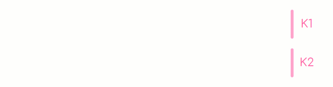
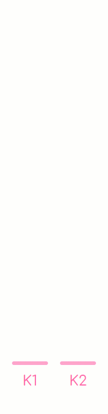

# osu! bar overlay
Visualize keyboard history for osu! in your stream.

## Example

### In Stream

https://user-images.githubusercontent.com/23134847/168428457-2ec663ab-d224-4821-a346-dc67a8f91911.mp4

### Horizontal

| __light__  |   |
:-------------------------:|:-------------------------:
| __square__  |   |

### Vertical

| __light__ | __square__ |
:-------------------------:|:-------------------------:
  |  

## Features

- Two styles available: square and light
- Customizable: keys, colors, speed, spacing, etc.
- Receives input from websocket (requires the OBS plugin [input-overlay](https://github.com/univrsal/input-overlay) 5.0 or [gosumemory](https://github.com/l3lackShark/gosumemory))

## Usage

1. Choose one of these input sources below, which provide real-time keyboard input data to the overlay

+ Install [input-overlay](https://github.com/univrsal/input-overlay) plugin 5.0, and turn on the websocket checkbox in plugin settings.

+ Install [gosumemory](https://github.com/l3lackShark/gosumemory), and set a smaller update interval in the gosumemory config file to reduce latency.

2. Download the built files from [release](https://github.com/solstice23/osu-bar-overlay/releases), edit `/config.js` to set your preferences.

3. Add a browser source in the OBS, check "Local file" and set the URL to `E:/osu-bar-overlay/index.html` (your path). Maybe you should set the width and height to proper values to fit the overlay.

4. Enjoy it!

## TODO

- [x] Receive input from [gosumemory](https://github.com/l3lackShark/gosumemory)
- [x] Round corners
- [ ] Fix glitches of the keys when the round corners are enabled in the square style
- [x] More key styles
